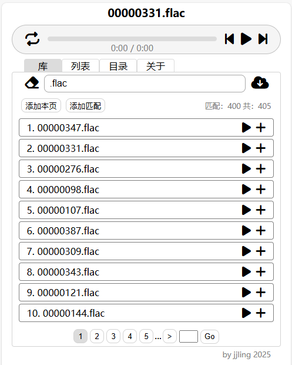

# SimpleWebMusicPlayer
这是一个播放服务器里面的音乐的网页应用。是 [typecho-mini](https://github.com/jjling2011/typecho-mini) 项目里面的一个小功能。比较简陋，也不打算添加复杂的功能。

### 安装
 * 从 [releases](https://github.com/jjling2011/SimpleWebMusicPlayer/releases/latest/) 下载 zip 包，解压到支持 php 的 web 目录
 * 随便复制几个 mp3 文件到那个目录里面

访问 serv.php 会看到一个列出所有音乐文件路径的 JSON 页面。  
访问 index.html 会看到播放器页面。  

  

### 高级用法
 * 可以添加 flac 等其他格式音乐，至于能不能播放就得看浏览器支不支持了
 * 音乐文件可以放到文件夹里面，也可以用符号链接指向其他目录，但是要注意权限。运行 web 服务的账号要有真实路径中每个文件夹的 rx （读取和执行）权限
 * 这个播放器不支持设置密码，但是 web 服务器通常都支持 .htpasswd，可以自行生成 .htpasswd 文件来添加访问密码

### 自行构建
```bash
# 安装 vite 等依赖
npm install

# 构建
npm run build
```
生成的文件在 `dist` 目录内

### 更新日志
[update.md](./update.md)  
